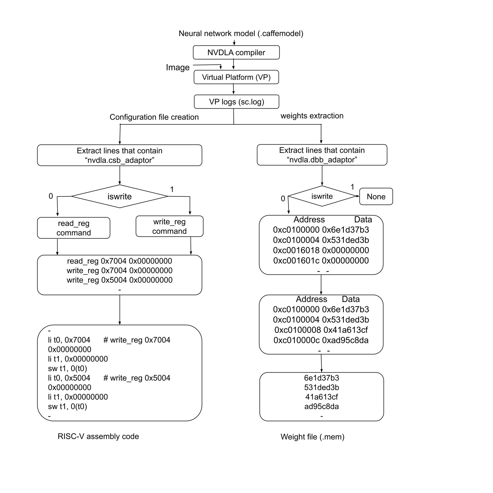

# RISC-V-NVDLA
Software generation for Bare-metal RISC-V + NVDLA SoC  
## Software Development Flow



---

## Steps to Generate Required Files for DNN Model Deployment

### **Step 1: Generating `.mem` File (for RISC‑V Program Memory)**

These steps are used to initialize program memory of RISC‑V for a DNN model:

1. **Generate `sc.log` file** by running NVDLA loadable (`.nvdla` file) of a given Caffe model.
2. Run `assembly.py` followed by `minus_c0.py` file to generate `model.s` file.
3. Use RISC‑V toolchain to generate machine code.  
   > *We used Codasip Studio SDK to generate machine code for `model.s`.*
4. Process `machine_code_model.txt` using `clean_machine_code.py` to generate `.mem` file and insert an offset address in the file if required.

#### **Commands to Generate `.mem` File**
```bash
$ git clone https://github.com/vineetbitsp/riscv-nvdla.git
$ cd ~/riscv-nvdla/
$ python3 lenet-5/pmem/assembly.py
$ python3 lenet-5/pmem/minus_c0.py

# Generate .mem file from machine code
$ cd lenet-5/pmem/machine_code2mem/
$ python3 machine_code_clean.py

Note: The offset address in program memory where machine code is stored must be inserted in the .mem file.
```

### **Step 2: Generating `.bin` File of Weights (for DRAM)**

These steps are used to generate a `.bin` file of weights to be loaded in DRAM:

1. Switch to the `dmem` directory inside `lenet-5`.
2. Execute the Python scripts in the following sequence:
```bash
$ python3 dbb_lines_extract.py
$ python3 dbb_lines2_weights.py 
$ python3 subtract_c0.py 
$ python3 weights_sorted.py
$ python3 divideby4.py
$ python3 remove_duplicates_divideBy4.py
$ python3 fill_missing_addr.py
$ python3 clean_weights.py 
$ python3 weights2bin.py
```
Note: The offset address at which the weight file is stored in DRAM is given by the first entry in the output file of weights_sorted.py and must be specified while storing the weight file in DRAM.
